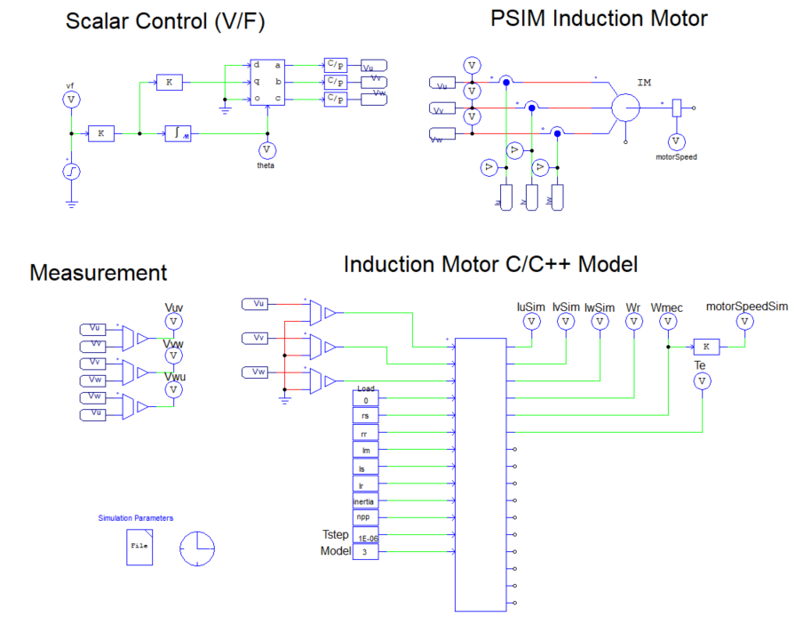
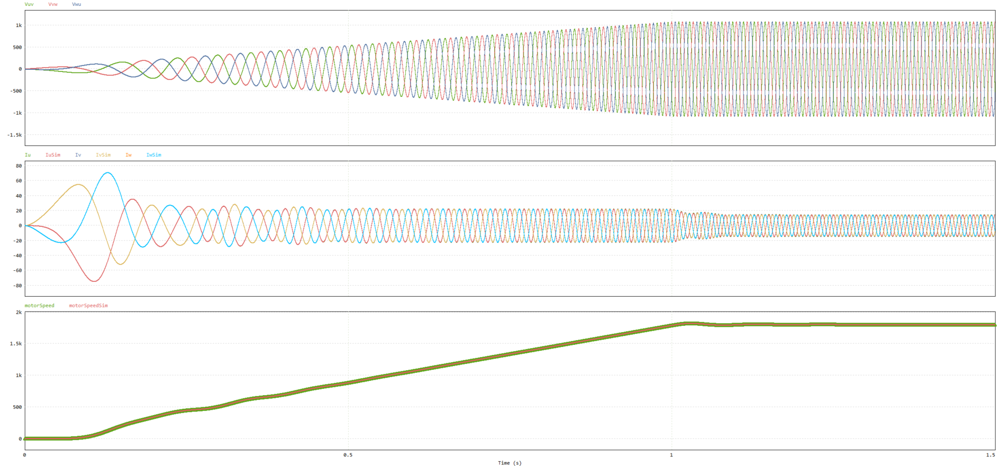
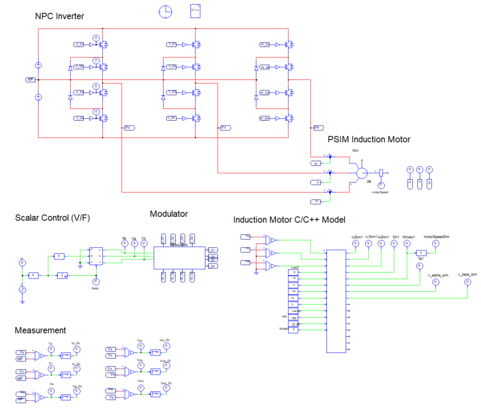
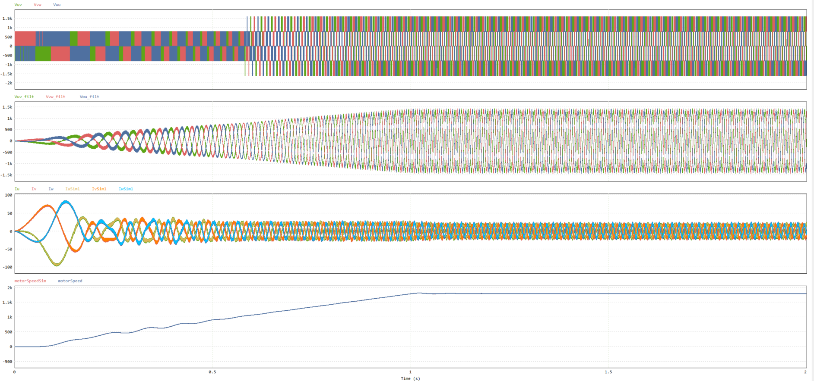

# Induction Machine Model

## Folder Structure

- `src/`: C source files for the induction machine model and simulation.
- `Debug/`: Compiled objects and the dynamic library (`.dll` and `.o` files).
- `images/`: Images for documentation and result visualization.
- `misc/`: Jupyter notebooks for auxiliary analysis and calculations.
- `psim/`: PSIM simulation files, organized into subfolders for different validation experiments.

## Simulation / Validation (Ideal Conditions)

The goal of this initial simulation was to validate the developed model by comparing it against the PSIM reference model under **ideal conditions**, using a **perfect voltage source** with scalar V/f control.

  
  

## PWM Simulation / Validation

In this second simulation, the objective was to validate the model's performance under **PWM switching conditions** using an **NPC inverter**. The comparison was again made with the PSIM reference model, and the test aimed to evaluate the behavior of the model in a more realistic power electronics environment.

  
  

